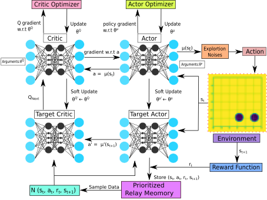
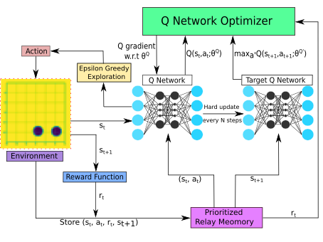

# DDQN

## Description

Using deep reinforcement learning to design a broadband acoustic cloak.

## Credits
Images:
[Linwei Zhou](https://github.com/DiuLaMaX)

Inspiration for structuring agents:
[Ray](https://github.com/ray-project/ray)